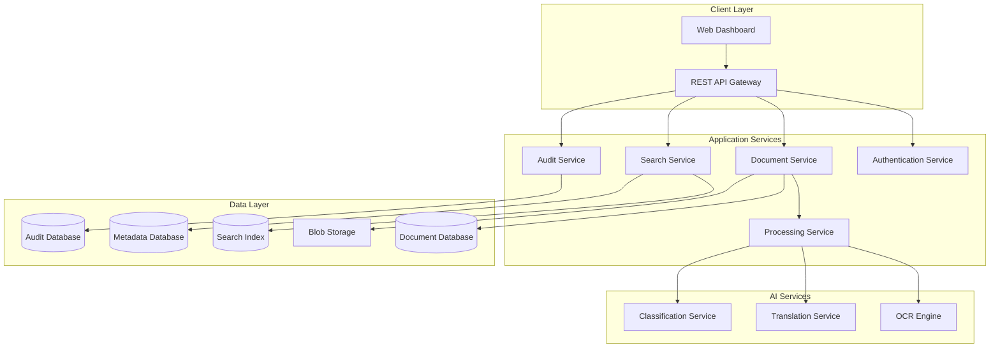
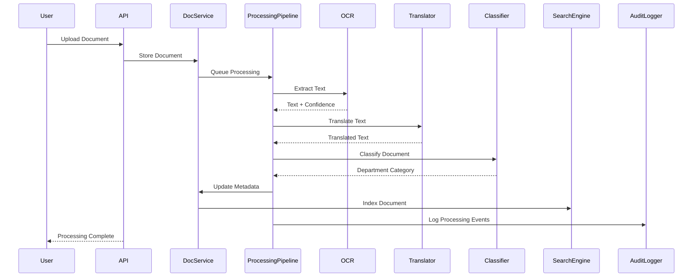

# Design Document: KMRL DocRecords

## Overview

KMRL DocRecords is designed as a microservices-based document digitization platform that transforms government paperwork into an intelligent, searchable digital archive. The system employs a layered architecture with distinct services for document processing, AI operations, storage, and user interfaces, ensuring scalability, maintainability, and security compliance for government operations.

The platform follows a pipeline architecture where documents flow through sequential processing stages: ingestion → OCR → translation → classification → metadata extraction → storage → indexing. Each stage is independently scalable and can handle failures gracefully through retry mechanisms and dead letter queues.

## Architecture

### High-Level Architecture



### Service Architecture

**API Gateway Layer**: Handles authentication, rate limiting, request routing, and response aggregation. Implements JWT-based authentication with role-based access control.

**Document Service**: Manages document lifecycle, metadata, and storage operations. Coordinates with processing pipeline and maintains document state.

**Processing Service**: Orchestrates the AI pipeline through asynchronous job queues. Handles retry logic, error recovery, and progress tracking.

**AI Services**: Independent microservices for OCR, translation, and classification. Each service can be scaled independently based on processing load.

**Search Service**: Provides full-text search capabilities using Elasticsearch with Malayalam language support and metadata filtering. Implementation option: Amazon OpenSearch for managed search with automatic scaling.


**Audit Service**: Captures all system events in immutable logs with cryptographic integrity verification.

## Components and Interfaces

### Core Components

**Document Manager**
- Interface: `IDocumentManager`
- Responsibilities: Document CRUD operations, version control, access validation
- Key Methods: `uploadDocument()`, `getDocument()`, `updateMetadata()`, `deleteDocument()`

**Processing Pipeline**
- Interface: `IProcessingPipeline`
- Responsibilities: Coordinate AI services, manage job queues, handle failures
- Key Methods: `processDocument()`, `getProcessingStatus()`, `retryFailedJob()`
- Implementation Option: AWS Lambda for serverless backend automation and processing orchestration

**OCR Engine**
- Interface: `IOCREngine`
- Responsibilities: Text extraction from images, confidence scoring, Malayalam support
- Key Methods: `extractText()`, `getConfidenceScore()`, `supportedLanguages()`
- Implementation Option: Amazon Textract for advanced OCR with Malayalam language support

**Translation Service**
- Interface: `ITranslationService`
- Responsibilities: Malayalam ↔ English translation, quality assessment
- Key Methods: `translate()`, `detectLanguage()`, `getTranslationQuality()`
- Implementation Option: Amazon Translate for neural machine translation between Malayalam and English

**Classification Engine**
- Interface: `IClassificationEngine`
- Responsibilities: Department categorization, confidence scoring, manual override support
- Key Methods: `classifyDocument()`, `getCategories()`, `updateModel()`

**Search Engine**
- Interface: `ISearchEngine`
- Responsibilities: Full-text search, metadata filtering, result ranking
- Key Methods: `search()`, `indexDocument()`, `updateIndex()`

**Access Control Manager**
- Interface: `IAccessControlManager`
- Responsibilities: User authentication, authorization, role management
- Key Methods: `authenticate()`, `authorize()`, `getUserRoles()`
- Implementation Option: Amazon Cognito for user management and multi-factor authentication

**Audit Logger**
- Interface: `IAuditLogger`
- Responsibilities: Event logging, compliance reporting, integrity verification
- Key Methods: `logEvent()`, `generateReport()`, `verifyIntegrity()`

### Data Flow



## Data Models

### Document Model
```typescript
interface Document {
  id: string;
  originalFilename: string;
  fileType: string;
  fileSize: number;
  uploadDate: Date;
  uploadedBy: string;
  status: DocumentStatus;
  content: {
    originalText: string;
    translatedText?: string;
    ocrConfidence: number;
    translationConfidence?: number;
  };
  metadata: {
    department: DepartmentType;
    classificationConfidence: number;
    year: number;
    documentType: string;
    tags: string[];
    customFields: Record<string, any>;
  };
  security: {
    accessLevel: SecurityLevel;
    authorizedRoles: string[];
    encryptionKey: string;
  };
  processing: {
    ocrJobId?: string;
    translationJobId?: string;
    classificationJobId?: string;
    lastProcessed: Date;
    processingErrors: ProcessingError[];
  };
}

enum DocumentStatus {
  UPLOADED = 'uploaded',
  PROCESSING = 'processing',
  COMPLETED = 'completed',
  FAILED = 'failed',
  ARCHIVED = 'archived'
}

enum DepartmentType {
  HR = 'hr',
  FINANCE = 'finance',
  OPERATIONS = 'operations',
  TECHNICAL = 'technical',
  ENGINEERING = 'engineering',
  INCIDENT_REPORTS = 'incident_reports',
  UNCLASSIFIED = 'unclassified'
}

enum SecurityLevel {
  PUBLIC = 'public',
  INTERNAL = 'internal',
  CONFIDENTIAL = 'confidential',
  RESTRICTED = 'restricted'
}
```

### User Model
```typescript
interface User {
  id: string;
  username: string;
  email: string;
  roles: Role[];
  department: DepartmentType;
  securityClearance: SecurityLevel;
  lastLogin: Date;
  isActive: boolean;
  preferences: {
    defaultLanguage: 'malayalam' | 'english';
    searchFilters: SearchFilter[];
  };
}

interface Role {
  name: string;
  permissions: Permission[];
  departmentAccess: DepartmentType[];
}

interface Permission {
  resource: string;
  actions: string[];
}
```

### Audit Event Model
```typescript
interface AuditEvent {
  id: string;
  timestamp: Date;
  userId: string;
  action: string;
  resource: string;
  resourceId: string;
  details: Record<string, any>;
  ipAddress: string;
  userAgent: string;
  result: 'success' | 'failure';
  errorMessage?: string;
  integrity: {
    hash: string;
    previousHash: string;
    signature: string;
  };
}
```

## Correctness Properties

*A property is a characteristic or behavior that should hold true across all valid executions of a system—essentially, a formal statement about what the system should do. Properties serve as the bridge between human-readable specifications and machine-verifiable correctness guarantees.*

### Property Reflection

After analyzing all acceptance criteria, several properties can be consolidated to eliminate redundancy:

- File validation properties (format and size) can be combined into comprehensive input validation
- OCR processing properties can be grouped by functionality (extraction, confidence, error handling)
- Translation properties follow similar patterns and can be consolidated
- Classification properties share common confidence threshold logic
- Metadata properties can be combined for extraction, storage, and versioning
- Search properties can be unified around query processing and result formatting
- Access control properties share authorization verification patterns
- Audit properties can be consolidated around logging completeness and integrity
- Performance properties can be grouped by operation type
- Storage properties can be unified around encryption, backup, and recovery

### Document Input and Processing Properties

**Property 1: File format validation**
*For any* uploaded file, the system should accept the file if and only if it has a valid extension (PDF, JPEG, PNG, TIFF) and reject all other formats with appropriate error messages
**Validates: Requirements 1.1, 1.3**

**Property 2: File size validation**
*For any* uploaded file, the system should accept files under 50MB and reject files 50MB or larger with size limit error messages
**Validates: Requirements 1.2**

**Property 3: Document identifier uniqueness**
*For any* set of successfully uploaded documents, all generated document identifiers should be unique and non-empty
**Validates: Requirements 1.4**

**Property 4: Concurrent processing independence**
*For any* set of documents uploaded simultaneously, each document should be processed independently without affecting the processing outcome of other documents
**Validates: Requirements 1.5**

### OCR Processing Properties

**Property 5: OCR text extraction completeness**
*For any* document image with readable text, the OCR engine should extract text content and store both the original image and extracted text
**Validates: Requirements 2.1, 2.2**

**Property 6: OCR confidence threshold handling**
*For any* OCR processing result, documents with confidence below 70% should be flagged for manual review while documents with confidence 70% or above should proceed normally
**Validates: Requirements 2.3**

**Property 7: OCR error handling**
*For any* OCR processing failure, the system should log the error, notify the user, and maintain access to the original document
**Validates: Requirements 2.4**

**Property 8: Malayalam Unicode compliance**
*For any* document containing Malayalam text, the OCR processing should maintain proper Unicode character encoding throughout the extraction process
**Validates: Requirements 2.5**

### Translation Properties

**Property 9: Bidirectional translation capability**
*For any* text in Malayalam or English, the translation service should be able to convert it to the other language upon request
**Validates: Requirements 3.1, 3.2**

**Property 10: Translation data preservation**
*For any* translation request, the system should preserve the original text and store the translation separately, maintaining access to both versions
**Validates: Requirements 3.3, 3.5**

**Property 11: Translation confidence reporting**
*For any* translation operation, the system should provide confidence levels to users when translation quality is uncertain
**Validates: Requirements 3.4**

### Classification Properties

**Property 12: Department classification completeness**
*For any* processed document, the classifier should assign it to exactly one of the valid department categories (HR, Finance, Operations, Technical, Engineering, Incident Reports, or Unclassified)
**Validates: Requirements 4.1, 4.4**

**Property 13: Classification confidence thresholds**
*For any* classification result, documents with confidence above 80% should be auto-assigned while documents with confidence below 80% should prompt for manual selection
**Validates: Requirements 4.2, 4.3**

**Property 14: Classification manual override**
*For any* classified document, authorized users should be able to manually override the assigned classification
**Validates: Requirements 4.5**

### Metadata Management Properties

**Property 15: Metadata extraction and storage**
*For any* processed document, the system should extract and store all required metadata fields (upload date, file size, document type, department, year, category)
**Validates: Requirements 5.1, 5.2**

**Property 16: Metadata completeness validation**
*For any* document with incomplete required metadata, the system should prompt users to provide missing fields before allowing the document to be finalized
**Validates: Requirements 5.3**

**Property 17: Metadata version history**
*For any* metadata update operation, the system should maintain a complete version history of all changes with timestamps and user information
**Validates: Requirements 5.4**

### Search and Retrieval Properties

**Property 18: Search result accuracy**
*For any* search query, all returned documents should contain matching text in either content or metadata, and results should be filtered and sorted according to applied criteria
**Validates: Requirements 6.1, 6.2, 5.5**

**Property 19: Search result formatting**
*For any* search operation that returns results, each result should display document title, department, date, and relevance score
**Validates: Requirements 6.3**

**Property 20: Search assistance for empty results**
*For any* search query that returns no results, the system should provide alternative search terms or broader filter suggestions
**Validates: Requirements 6.4**

**Property 21: Search audit logging**
*For any* search operation, the query details should be logged in the audit trail for compliance purposes
**Validates: Requirements 6.5**

### Access Control Properties

**Property 22: Authorization verification**
*For any* document access attempt, the system should verify the user's authorization level matches the document's security requirements before granting access
**Validates: Requirements 7.1**

**Property 23: Unauthorized access handling**
*For any* unauthorized access attempt, the system should deny access and create a security event log entry
**Validates: Requirements 7.2**

**Property 24: Role-based department access**
*For any* user with assigned roles, the system should enforce department-based access restrictions according to their role permissions
**Validates: Requirements 7.3**

**Property 25: Multi-factor authentication for sensitive documents**
*For any* access attempt to sensitive documents, the system should require additional authentication factors beyond basic login
**Validates: Requirements 7.4**

**Property 26: Session security management**
*For any* expired user session, the system should automatically log out the user and clear all cached document data
**Validates: Requirements 7.5**

### Audit and Compliance Properties

**Property 27: Comprehensive audit logging**
*For any* document operation, the system should create an immutable audit log entry containing timestamp, user, action details, and integrity verification
**Validates: Requirements 8.1**

**Property 28: Audit reporting capabilities**
*For any* audit log request, the system should provide searchable and exportable compliance reports
**Validates: Requirements 8.2**

**Property 29: Security event alerting**
*For any* security event occurrence, the system should immediately alert designated administrators
**Validates: Requirements 8.3**

**Property 30: Anomaly detection and flagging**
*For any* unusual document access pattern, the system should flag potential security concerns for investigation
**Validates: Requirements 8.4**

**Property 31: Data retention policy enforcement**
*For any* audit data older than 7 years, the system should archive logs according to government retention policies
**Validates: Requirements 8.5**

### Performance Properties

**Property 32: OCR processing time limits**
*For any* document under 10MB, OCR processing should complete within 30 seconds
**Validates: Requirements 9.1**

**Property 33: Concurrent user performance**
*For any* search operation with multiple simultaneous users, response times should remain under 3 seconds
**Validates: Requirements 9.2**

**Property 34: Load management and user notification**
*For any* high system load condition, processing tasks should be queued and users should receive expected completion time notifications
**Validates: Requirements 9.3**

**Property 35: Fault tolerance and recovery**
*For any* system failure, the system should automatically recover and resume processing without data loss
**Validates: Requirements 9.4**

**Property 36: Maintenance notification**
*For any* scheduled maintenance, all users should receive 24-hour advance notice
**Validates: Requirements 9.5**

### Data Storage Properties

**Property 37: Data encryption at rest**
*For any* stored document, the data should be encrypted using AES-256 encryption
**Validates: Requirements 10.1**

**Property 38: Backup schedule compliance**
*For any* backup operation, the system should create daily incremental backups and weekly full backups according to schedule
**Validates: Requirements 10.2**

**Property 39: Storage capacity monitoring**
*For any* storage capacity reaching 80%, the system should alert administrators and provide capacity planning recommendations
**Validates: Requirements 10.3**

**Property 40: Data corruption recovery**
*For any* detected data corruption, the system should automatically restore from the most recent valid backup
**Validates: Requirements 10.4**

**Property 41: Backup verification and integrity**
*For any* monthly backup verification, the system should confirm data integrity and restoration capability
**Validates: Requirements 10.5**

## Implementation Options

### Cloud Services Integration

For organizations seeking managed cloud solutions, the following AWS services can be integrated as implementation options:

**Document Storage**: Amazon S3 provides scalable, secure file storage with built-in encryption and lifecycle management for document archival.

**Metadata Storage**: Amazon DynamoDB offers fast, flexible NoSQL database for storing document metadata with automatic scaling capabilities.

**Image Processing**: Amazon Rekognition can be used for document image analysis and preprocessing before OCR processing.

**Backend Automation**: AWS Lambda enables serverless processing functions that automatically scale based on document processing demand.

These cloud services can be integrated alongside or as alternatives to traditional infrastructure components, providing operational simplicity and reduced maintenance overhead for government organizations.

## Error Handling

### Error Categories and Responses

**Input Validation Errors**
- Invalid file formats: Return HTTP 400 with specific format requirements
- File size exceeded: Return HTTP 413 with size limit information
- Missing required fields: Return HTTP 400 with field validation details

**Processing Errors**
- OCR failures: Log error, notify user, maintain original document access
- Translation failures: Preserve original text, log error, continue with untranslated content
- Classification failures: Assign to "Unclassified" category, log for manual review

**System Errors**
- Database connection failures: Implement circuit breaker pattern, retry with exponential backoff
- AI service unavailability: Queue requests for retry, notify users of delays
- Storage failures: Attempt backup storage, alert administrators immediately

**Security Errors**
- Unauthorized access: Log security event, return HTTP 403, alert administrators
- Authentication failures: Log attempt, implement rate limiting, return generic error
- Session expiration: Clear cached data, redirect to login, log session end

### Error Recovery Strategies

**Graceful Degradation**
- If OCR service fails, allow manual text entry
- If translation service fails, continue with original language
- If classification fails, allow manual categorization

**Retry Mechanisms**
- Exponential backoff for transient failures
- Dead letter queues for persistent failures
- Manual retry options for critical operations

**Data Consistency**
- Transaction rollback for partial failures
- Eventual consistency for distributed operations
- Conflict resolution for concurrent updates

## Testing Strategy

### Dual Testing Approach

The testing strategy employs both unit testing and property-based testing as complementary approaches:

**Unit Tests**: Focus on specific examples, edge cases, and integration points between components. These tests verify concrete scenarios and ensure proper error handling for known failure modes.

**Property Tests**: Verify universal properties across all inputs through randomized testing. These tests ensure correctness properties hold for the vast input space that unit tests cannot cover.

### Property-Based Testing Configuration

**Testing Framework**: Use Hypothesis (Python) or fast-check (TypeScript) for property-based testing
**Test Iterations**: Minimum 100 iterations per property test to ensure adequate coverage
**Test Tagging**: Each property test must reference its design document property using the format:
`# Feature: kmrl-docrecords, Property {number}: {property_text}`

### Testing Categories

**Input Validation Testing**
- Unit tests: Specific file formats, exact size limits, known invalid inputs
- Property tests: Random file generation, size variations, format combinations

**OCR Processing Testing**
- Unit tests: Specific document types, known Malayalam text samples, error conditions
- Property tests: Random image generation, text content variations, confidence levels

**Translation Testing**
- Unit tests: Specific Malayalam-English pairs, known translation challenges
- Property tests: Random text generation, bidirectional translation consistency

**Classification Testing**
- Unit tests: Representative documents from each department, edge cases
- Property tests: Random document content, confidence threshold variations

**Search Testing**
- Unit tests: Specific queries, known result sets, filter combinations
- Property tests: Random query generation, metadata combinations, result validation

**Security Testing**
- Unit tests: Specific role combinations, known access patterns
- Property tests: Random user/document combinations, permission variations

**Performance Testing**
- Unit tests: Specific load scenarios, known bottlenecks
- Property tests: Random load patterns, concurrent user simulations

### Integration Testing

**End-to-End Workflows**
- Document upload → OCR → Translation → Classification → Storage → Search
- User authentication → Document access → Audit logging
- Backup creation → Corruption simulation → Recovery verification

**API Testing**
- REST endpoint validation
- Authentication and authorization flows
- Error response consistency

**Database Testing**
- Data integrity constraints
- Transaction isolation
- Backup and recovery procedures